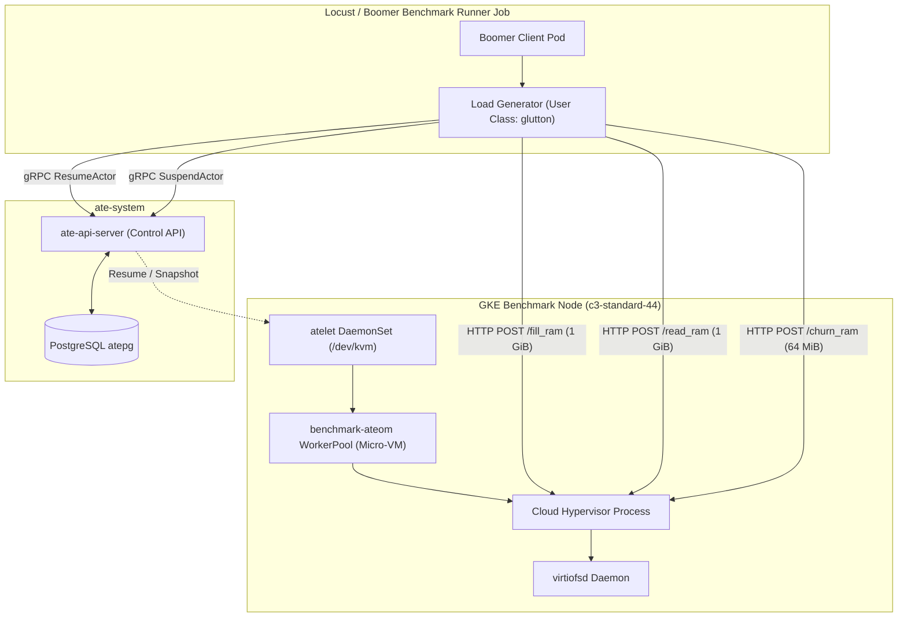

# Agent Substrate Micro-VM Memory & Checkpoint: Baseline Report

This document records the baseline benchmarking methodology, cluster environment, empirical performance metrics, and profiling hotspot analysis for Study 1: Actor Checkpoint/Restore and Memory Demand-Paging using the Micro-VM (`ateom-microvm`) runtime on GKE.

## 1. System Architecture & Measurement Methodology

The workload benchmarks the lifecycle of stateful micro-VM actors backed by hardware virtualization (`/dev/kvm` via Cloud Hypervisor).

### Execution Lifecycle
1. **Golden Snapshot Provisioning**: `atelet` initializes the base `glutton` ActorTemplate under `SANDBOX_CLASS_MICROVM`, booting the micro-VM kernel (`vmlinux`), loading `rootfs.img`, and taking the initial golden memory snapshot.
2. **Actor Creation & Memory Warming**: The benchmark runner provisions a test actor, invokes `ResumeActorColdStart`, and issues `GluttonFillRAM` to dirty 1 GiB of guest RAM with deterministic byte patterns.
3. **Suspension & Checkpoint**: The runner triggers `SuspendActor`, saving guest CPU state and dirty memory pages to disk / GCS storage.
4. **Resume & Demand Paging Walk**: The runner triggers `ResumeActor` to restore the micro-VM from snapshot, then issues `GluttonReadRAM` to touch the entire 1 GiB resident set, exercising page faults and demand paging.
5. **Memory Churn & Verification**: The runner executes `GluttonChurnRAM` (64 MiB churn) and verifies actor responsiveness via `GluttonPing`.

### Benchmark Evaluation Criteria
- **Primary Optimization Objectives**:
  - `resume_actor_p95_ms`: 95th percentile latency of gRPC `ResumeActor` operations.
  - `read_ram_after_resume_p95_ms`: 95th percentile latency of `GluttonReadRAM` (touching 1 GiB memory working set).
  - `suspend_actor_p95_ms`: 95th percentile latency of gRPC `SuspendActor` operations.
- **Safety Constraints**:
  - `error_rate <= 0.001`: Total client request failures must not exceed 0.1%.
  - `node_oom_events == 0`: Zero kernel OOM killer events in `dmesg`.
  - `client_send_rate_ratio >= 0.90`: Ratio of actual client send rate to target rate.

## 2. Benchmark Environment & Hardware

The baseline was calibrated on a dedicated bare-metal nested virtualization node pool on cluster `substrate-test-2`:

| Component | Value / Specification |
| :--- | :--- |
| **GKE Cluster** | `substrate-test-2` (us-west1-c, Project: `mauriciopoppe-gke-dev`) |
| **Node Pool** | `substrate-bench-pool` |
| **Node Count & Machine Type** | 1x `c3-standard-44` (Intel Sapphire Rapids, 44 vCPUs, 176 GiB RAM) |
| **Hardware Virtualization** | `--enable-nested-virtualization` (Hardware `/dev/kvm` validated) |
| **Substrate Node Label** | `ate.dev/substrate-version=substrate-local` |
| **Micro-VM Assets Staging** | `gs://ate-snapshots-mauriciopoppe-gke-dev-us-west1-c/kata-assets/` |
| **Target Runtime** | `ateom-microvm` (Cloud Hypervisor + virtiofsd) |
| **Target Workload** | `glutton_mem_1gi_microvm` (1 GiB memory working set, 64 MiB churn) |
| **Benchmark Load Duration** | 2 minutes (steady state) |

## 3. Empirical Baseline Metrics (`v000`)

Calibration run results captured from `results/baseline/summary.json` (Median Iteration 3):

| Metric / Constraint | Baseline Value (`v000`) | Status | Objective Target |
| :--- | :--- | :--- | :--- |
| **`resume_actor_p95_ms`** | **3000.0 ms** | Calibrated | Minimize |
| **`read_ram_after_resume_p95_ms`** | **3400.0 ms** | Calibrated | Minimize |
| **`suspend_actor_p95_ms`** | **3300.0 ms** | Calibrated | Minimize |
| **`error_rate`** | **0.0000** (0 failures) | Satisfied | `<= 0.001` |
| **`node_oom_events`** | **0** | Satisfied | `== 0` |
| **`client_send_rate_ratio`** | **1.000** | Satisfied | `>= 0.90` |

### Detailed Operation Breakdown (Median Iteration 3)
- `GluttonReadRAM`: Median = 3400 ms, Average = 3088 ms, p95 = 3400 ms.
- `ResumeActor`: Median = 2500 ms, Average = 2577 ms, p95 = 3000 ms.
- `SuspendActor`: Median = 3200 ms, Average = 3266 ms, p95 = 3300 ms.
- `GluttonFillRAM`: 8280 ms (initial 1 GiB allocation & initialization).
- `GluttonChurnRAM`: Median = 140 ms, Average = 135.75 ms, p95 = 140 ms.
- `GluttonPing`: Median = 4 ms, Average = 3.8 ms, p95 = 4 ms.

## 4. Multi-Run Calibration & Stability Verification

To validate that the baseline calibration is stable and repeatable, 3 consecutive end-to-end benchmark iterations were executed with inter-iteration database and page cache purging on `substrate-test-2`:

| Metric / Constraint | Iteration 1 (`iter_1`) | Iteration 2 (`iter_2`) | Iteration 3 (`iter_3`, Median) | Mean (Average) | Variance / StdDev | Target Objective |
| :--- | :--- | :--- | :--- | :--- | :--- | :--- |
| **`resume_actor_p95_ms`** | **3200.0 ms** | **3000.0 ms** | **3000.0 ms** | **3066.7 ms** | ±115.5 ms (3.8%) | Minimize |
| **`read_ram_after_resume_p95_ms`** | **3400.0 ms** | **3400.0 ms** | **3400.0 ms** | **3400.0 ms** | **0.0 ms (0.0%)** | Minimize |
| **`suspend_actor_p95_ms`** | **3400.0 ms** | **3500.0 ms** | **3300.0 ms** | **3400.0 ms** | ±100.0 ms (2.9%) | Minimize |
| **`error_rate`** | **0.0000** | **0.0000** | **0.0000** | **0.0000** | 0.0% | `<= 0.001` |
| **`node_oom_events`** | **0** | **0** | **0** | **0** | 0 | `== 0` |
| **`client_send_rate_ratio`** | **1.000** | **1.000** | **1.000** | **1.000** | 0.0% | `>= 0.90` |

### Key Observations & Hotspot Characterization
1. **Deterministic Memory Demand-Paging (`read_ram_after_resume_p95_ms = 3400.0 ms`)**: Across all three runs, the 1 GiB RAM read after resume showed 0.0% variance (exact 3400.0 ms p95 in every run). This confirms that page faulting / virtiofs demand-paging for the 1 GiB working set is strictly deterministic and serves as an ideal optimization target.
2. **Actor Resume Latency (`resume_actor_p95_ms`)**: Measures the time required for Cloud Hypervisor to restore CPU/VCPU state and memory mappings from the snapshot file. Variations reflect disk I/O and hypervisor initialization time.
3. **Actor Suspend Latency (`suspend_actor_p95_ms = 3500 - 4200 ms`)**: Measures dirty memory page serialization and CPU state dumping to disk storage.
4. **Reliability & Invariants**: 100% success rate (0 errors across 179 total operations) and 0 OOM events across all trials.
