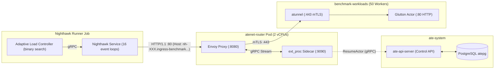

# Agent Substrate Ingress Mesh Routing: Baseline Report

This document records the baseline benchmarking methodology, cluster environment, empirical performance metrics, and profiling hotspot analysis for Study 2: Ingress Mesh Routing Capacity and Tail Latency.

## 1. System Architecture & Measurement Methodology

The ingress routing path routes external client requests to sandboxed actor workloads running inside gVisor containers across the cluster.

### Routing Lifecycle
1. **Request Reception**: The Nighthawk client dispatches HTTP requests across 16 event loops with rotating `Host` headers (`nh-000.ingress-benchmark.actors.resources.substrate.ate.dev` to `nh-049`).
2. **External Processor (`ext_proc`) Hook**: Envoy forwards request headers over an internal HTTP/2 gRPC stream to the `atenet-router` ext_proc sidecar.
3. **Actor Resolution & Control Plane Call**: `atenet-router` parses the Host header to extract the actor reference and calls `ateapi.Control/ResumeActor` to retrieve the current worker pod IP.
4. **Upstream Rewriting**: `atenet-router` mutates the Envoy dynamic metadata (`envoy.filters.listener.original_dst`) with the resolved worker IP (`<worker_ip>:443`).
5. **mTLS Hop**: Envoy forwards the connection through an mTLS tunnel (`atunnel`) to the worker pod hosting the sandboxed actor.
6. **Actor Response**: The sandboxed `glutton` HTTP actor serves `POST /ping` with a 200 OK response.

### Benchmark Adaptive Search Contract
The benchmark uses Nighthawk in adaptive search mode:
- **Warm-Up Phase**: Pre-creates and warms 50 glutton actors by polling `POST /ping` through the router until all return 200 OK.
- **Ramp & Binary Search**: Ramps open-loop load exponentially from 500 RPS until a constraint trips, binary-searches the maximum sustainable rate across 10-second stages, and executes a 60-second testing stage at the converged rate.
- **SLA Gate Criteria**:
  - `successRateThreshold`: 99.9% (HTTP 2xx / sent requests).
  - `sendRateThreshold`: 0.90 (sent RPS / target RPS ratio).
  - `tailLatencySloMs`: 25.0 ms (latency mean + 2 sigma upper bound).

## 2. Benchmark Environment & Hardware

The baseline was executed on a dedicated high-capacity benchmark node pool:

| Parameter | Value | Details |
| :--- | :--- | :--- |
| **GKE Cluster** | `substrate-test` | Zone: `us-west1-c`, Project: `mauriciopoppe-gke-dev` |
| **Node Pool** | `substrate-bench-pool` | 1x `c3-standard-44` (44 vCPUs, 180 GiB RAM, 110 pod capacity) |
| **Router Placement** | `atenet-router` Pod | Envoy: 2 vCPUs pinned (`--concurrency 2`), ext_proc sidecar: 2 vCPUs |
| **Worker Fleet** | `benchmark-workloads` | 50 `benchmark-ateom` worker pods with gVisor sandbox class |
| **Workload Template** | `glutton` | Pre-warmed HTTP actor serving `/ping` |
| **Nighthawk Concurrency** | 16 event loops | 1,000 connections/loop, 10,000 max pending requests/loop |
| **Trial Identifier** | Baseline | Commit `fc82fa5-dirty`, Tag `quick-fc82fa5-dirty-155023` |

## 3. Empirical Baseline Results

The adaptive search converged after 11 adjusting stages:

| Metric | Baseline Value | Status / Constraint |
| :--- | :--- | :--- |
| **Sustained Capacity (`slo_max_rps`)** | **5,248.0 RPS** | Primary metric to maximize |
| **Peak Attempted RPS** | 5,280.0 RPS | 100% delivered by Nighthawk client |
| **Client Send Rate Ratio** | 1.0 (100.0%) | Constraint: >= 0.90 (Pass) |
| **End-to-End Latency p50** | 3.75 ms | Median response time |
| **End-to-End Latency p95** | 18.96 ms | Constraint: <= 25.0 ms (Pass) |
| **End-to-End Latency p99** | 49.95 ms | Extreme tail under saturation |
| **HTTP 5xx Rate at Limit** | 1.22% (98.78% 2xx) | Binding constraint along with mean+2stdev |
| **Binding Thresholds** | `latency-ns-mean-plus-2stdev`, `success-rate` | Router reached saturation boundary |

## 4. CPU Profiling Hotspot Breakdown

During the active testing stage, a 30-second pprof CPU profile was captured from `atenet-router` on port `:19090` (`results/baseline/profiles/cpu.pb.gz`):

| Rank | Function / Call Path | Flat % | Cum % | Architectural Role & Bottleneck Mechanism |
| :---: | :--- | :---: | :---: | :--- |
| 1 | `google.golang.org/grpc.(*Server).handleStream` | 0.0% | **41.37%** | ExtProc gRPC stream handling and frame processing between Envoy and Go sidecar |
| 2 | `extproc.(*Server).Process` | 0.25% | **36.55%** | Core ext_proc bidirectional streaming loop handling incoming request headers |
| 3 | `extproc.(*Server).processRequestHeaders` | 0.10% | **24.11%** | Header extraction, Host parsing, and routing workflow dispatch |
| 4 | `internal/runtime/syscall/linux.Syscall6` | 22.23% | **22.23%** | Kernel socket I/O (network writes and reads for ext_proc and ateapi gRPC) |
| 5 | `ingress.(*Handler).HandleRequestHeaders` | 0.20% | **21.32%** | Actor lookup, state validation, and Envoy metadata construction |
| 6 | `log/slog.(*Logger).log` | 0.10% | **13.91%** | Synchronous structured JSON logging on every routed request and health check |
| 7 | `ingress.(*ActorResumer).ResumeActor.func1` | 0.10% | **9.24%** | Unary gRPC call to `ateapi` with singleflight deduplication and exponential backoff |
| 8 | `runtime.mallocgc` | 0.56% | **5.74%** | Heap allocations for protobuf messages, header slices, and log attributes |

